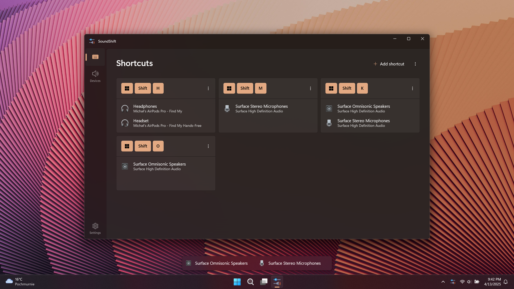

# SoundShift

SoundShift is a modern app that lets you quickly switch audio input and output to your preferred connected devices using customizable keyboard shortcuts. It allows you to change both the input and output device simultaneously with a single shortcut.

The app does not support changing the default device used by Microsoft Teams during an active call.

  

  

Feel free to share ideas about new features or report bugs.
